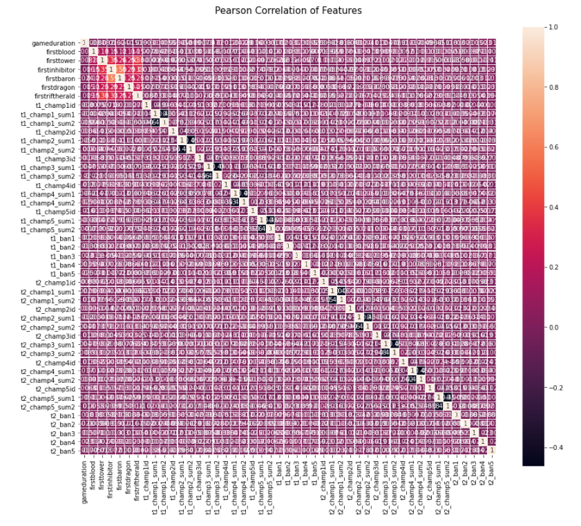
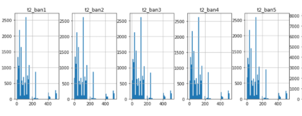
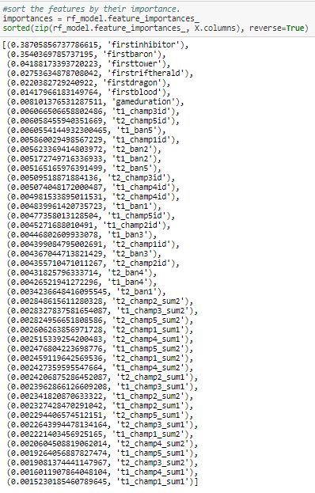
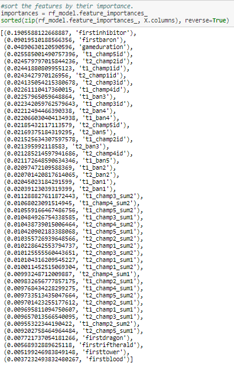

# League of Legends - Analysis of Gameplay Factors for the Winning Team

## Selected Topic

The selected topic for our final project was analyzing the conditions that factored into a team win in the game League of Legends. Using a data set pulled from the Riot API with data from 10,000 games worth of gameplay, we are looking for the most important factors that made the winning team successful, and creating a model to predict the outcome of a game as it progresses based on various statistics.

## Reason why the Topic was Selected

League of Legends is one of the most popular games ever created. Since its initial publication by Riot Games in 2009, it has become a globe encompassing e-sport with 115 million active monthly players currently worldwide. The money that comes along with this popularity is substantial, with millions of dollars’ worth of prizes every year. 

Given its popularity, most players analyze their game statistics, or those of a professional player, to improve. While there are many services that offer individual-player-specific analytics, not many focus on the overall team’s objectives, because (outside of competitive teams) it is a single-player game. Our interest in this meta-level analysis to find predicting factors in hero selection and gameplay is unique compared to the other analyses of League of Legends data we have seen.

## Background Information

League of Legends is a multiplayer online battle arena game, with two teams (team “Red” and team “Blue”) comprised of five players, where each player controls a single character with a set of abilities that improve as the character’s level increases.  Each team works together to advance down the three lanes on the game’s map to destroy the buildings the comprise the other team’s base. The ultimate objective is to destroy the other team’s main base structure, called the “Nexus.” There are many defenses standing between the other team and its Nexus, including 9 protective towers (which will auto-attack anything within range of them), and relatively weak computer-controlled units called “Minions” which  march down each of the lanes, attacking anything in their way until they are killed off. Destroying defensive units, the other team’s minions, and killing other heroes all award experience points and gold which allows players to level up and get better items and abilities. 
Another way to generate experience points and gain additional benefits is to kill “monsters” which populate the area between the lanes on the map. These monsters are classified as either a standard monster or an elite monster. The elite monsters are much more difficult to kill, and often require a much larger time investment on the part of the team, but they also grant much more powerful benefits to the team who defeats them. 

## Description of source data

Our data is originally sourced from the Riot API and includes match data from 50,000 games, which we found on [Kaggle]( https://www.kaggle.com/datasnaek/league-of-legends?select=champion_info). This includes which team (team Red or team Blue) ultimately won, as well as statistics regarding which team killed the first inhibitor, baron, dragon, or rift herald on the map, as well as how many of a team’s structures were destroyed before the destruction of the final “Nexus” structure which wins the game, and all heroes picked and banned during each ranked draft.

The first set of data is pulled from games by players playing within the "Diamond" level tier on the League of Legends ranking system. There are nine tiers within League of Legends which indicate the skill level of the player: Iron, Bronze, Silver, Gold, Platinum, Diamond, Master, Grandmaster, and Challenger. Being ranked in one of these levels allows the game's AI to match players of a similar skill level against each other. Master, Grandmaster, and Challenger tiers each comprise a single division of the most skilled and competitive League of Legends players and the rankings change every 24 hours, making Diamond the highest ranked standard tier (2.4% of the player base). We chose data from Diamond level players because the high level of skill required to achieve the rank removes other player-specific variables and assumes a certain level of understanding and mastery of the players' selected Champions and team's objectives. It is therefore a good baseline to analyze the data from. 

The second set of data is pulled from the Riot API based on a random set of player ID’s in ranked matches.  There are nine tiers within League of Legends which indicate the skill level of the player: Iron, Bronze, Silver, Gold, Platinum, Diamond, Master, Grandmaster, and Challenger. Being ranked in one of these levels allows the game's AI to match players of a similar skill level against each other. Master, Grandmaster, and Challenger tiers each comprise a single division of the most skilled and competitive League of Legends players and the rankings change every 24 hours. Players who play ranked matches are more driven to win than those who play unranked matches as any losses effects their standing within the ranking tiers. Choosing only data from ranked matches allows us to select for the most driven, competitive players in the game. 

## Questions we hope to answer with the data

With our analysis of this League of Legends data set, we hope to identify what factors contribute most to a team’s victory in the current game patch. We hope to then be able to, given a set of parameters, confidently predict the outcome of a match. While ultimately the skill of the individual players wins or loses the game, having objectives to work towards increases team cohesion and will enable better gameplay. 

## Method

***Extracting, Transforming, and Loading the League of Legends Data***

Our data set provides 58 columns, giving statistics on how the teams played. Each of these terms is applied to both red and blue teams in the data set. The list is as follows:


Column Term | Definition
------------ | -------------
gameDuration	| The duration of the game in seconds.
winner		| Whether the Blue or Red team won.
FirstBlood		| Which team got the first kill of a Champion in the game.
firstTower		| The first team that destroyed one of the other team's towers.  Towers are basic defensive structures protecting each team’s base. There are three layers of towers in each lane, and two in the base protecting the Nexus.
firstInhibitor	| The first team that destroyed one of the other team's inhibitors. The inhibitor lies at the end of each lane of towers and destroying it will give a power up for the team’s minions.
firstBaron	| Which team first killed the Baron Nashor, the most powerful monster on Summoner’s Rift map. The Baron gives a damage boost to the team that kills it.  
firstRiftHerald		| Which team first killed the Rift Herald, a monster on Summoner’s Rift map. After being defeated she will assist whichever team killed her in sieging an enemy’s structures. 
tN_champNid		| The champion each player on each team has chosen to play.
tN_champN_sum1	| The first of two Summoner Spells each player can select for their champion. These are special abilities which provide different and unique effects for the champions in the game.
tN_champN_sum2	| The second of two Summoner Spells each player can select for their champion. These are special abilities which provide different and unique effects for the champions in the game.
tN_towerKills		| The number of times a member of the Red or Blue team destroyed one of the other team's towers. There are 11 towers for each team.
tN_inhibitorKills		| The number of times a member of the Red or Blue team destroyed one of the other team's inhibitors. There are 3 inhibitors for each team.
tN_baronKills	| The number of times a member of the Red or Blue team killed the Baron Nashor.  
tN_dragonKills	| The number of times a member of the Red or Blue team killed a dragon - which grant special abilities and change the layout of the map.
tN_riftHeraldKills	| The number of times a member of the Red or Blue team killed the Rift Herald. The Rift Herald can only be killed twice per game. 
tN_ban1N  	| The champion each team has banned during hero selection before the start of the game. Each team gets to ban five heroes.


Much of the data in the dataset pertains to the champions, bans, and spells on each team. The dataframe we created from the CSV file from Kaggle has integer values in each of these columns, which refence the corresponding value as detailed in two JSON files. While no transformation needed to be done to analyze this data, we did notice that many of the “firsts” columns had null values. Since we had such a large data set to work with, we decided to remove any row with any single null column, which reduced our data from over 50,000 rows to just over 16,000. We still feel that this is a substantial enough data set to analyze for our purposes.

Another transformation we made to the data was to be mindful of game duration. We are interested in analyzing gameplay from standard matches, the duration of which averages around 33 minutes. We had several outliers that finished their games in under 1,000 seconds (16 minutes). We can assume that this could be for a myriad of reasons, but the most likely reason is the the teams voted to concede the game due to a factor that we are not interested in, such as a lagging, or non-participatory team member, or another extreme factor of some kind. Due to this, we dropped all games that ended in less that 1,000 seconds. We did not clean the data for games that were outliers in the opposite direction, because we felt that longer games would have factors that were worth analyzing and would not be won or lost by factors outside of what we are analyzing. 


…
#looking at game duration to see any trends in game duration among ranked play participants 

df['gameduration'].describe()

count    16343.000000
mean      2005.307349
std        384.027786
min       1241.000000
25%       1720.000000
50%       1963.000000
75%       2242.000000
max       4132.000000
Name: gameduration, dtype: float64
…


####
***Modeling our Data***
Our first step in modeling the data was looking for correlations within the data, which we did using a heat map. 



We saw that we had a lot of un-correlated data, and some negatively-correlated data, along with one hot spot of correlation around the game “firsts.” This was extremely promising as the purpose of this analysis was to look for win predictors, and these all appear to be good candidates. 
Some data points showed to be the opposite, specifically the summoning spell choices which were the negatively correlated values. We re-ran the heat map after dropping those values, and got a much clearer image of the same picture. 


We ran a random forest classifier on our data set and got an 88% accuracy score. Surprised at this high level of performance on the first go, we decided to take a closer look at our data to make sure we were not over-fitting our model. A quick plot of histograms for each column showed us that the distributions for each team’s champion ID and bans were practically identical. An example of this can be seen in a snippet of team bans below. 



We realized that we needed to be mindful of overfitting and bias in the data set. From the histograms, it was clear that this had to do with the fact that certain spells, bans, and champions are more popular among players than others. 

This issue was even more extreme with the spell choices, which was causing the negative correlation seen on the heatmap. For each team we wanted to see how biased the data was when it came to the incidence of the spells in the games played. Below is a snippet of code to find Blue team’s total picks for each spell.  The dictionary we are referencing is a dictionary we created from the JSON file with the spell names as the values and reference integers in the data frame as the keys. As you can see from our output below, Flash (which is the spell corresponding to number 4) is almost consistently chosen, and there are only a handful of other spells, all of which are chosen far more frequently than the others. 


```
#count the summoner spells for team 1 
for number in dict_spells_2.keys():
    counter = 0
    for column in ['t1_champ1_sum1','t1_champ1_sum2','t1_champ2_sum1','t1_champ2_sum2','t1_champ3_sum1','t1_champ3_sum2',
          't1_champ4_sum1','t1_champ4_sum2','t1_champ5_sum1','t1_champ5_sum2']:
        for i in df[column]:
            if i == number:
                counter += 1 
    dict_spells_1[number] = counter
dict_spells_1
{1: 1543,
 3: 42253,
 4: 252008,
 6: 7196,
 7: 54085,
 11: 51524,
 12: 54602,
 13: 0,
 14: 44236,
 21: 7453,
 30: 0,
 31: 0,
 32: 0,
 33: 0,
 34: 0,
 35: 0,
 36: 0}
```


This trend remained largely consistent between the two teams. See below two bar charts showing the distribution of the count of heroes selected from each team. 


We wanted to avoid the over-fitting and bias in our models due to the weighting described above and therefore chose to separate our data into three parts – what we will call the “pre-game,” “early-game,” and “end-game” variables. The pre-game factors are champion picks, summoner spell picks, and champion bans. In short, this includes all data that pertains to the Champion Select before the start of the game. The early-game data includes which team got first blood, first tower, first inhibitor, first baron, and first dragon. End-game data includes totals for the teams at the completion of the game. These are total tower kills, inhibitor kills, baron kills, dragon kills, and rift herald kills for each team. 


*** Pre-Game Data ***
For our pre-game data set, we included all elements of our data set that are decided before gameplay begins. This includes champions chosen for each team, champions banned by each team, and the two summoner spells chosen by each player. Our model variable was “winner,” and we wanted to see if champions, bans, or spell selections could predict the which team would win. Once again we used a random forest classifier model, as we were looking at many branches of variables with five separate champions on each team. Our accuracy score from this model was 50.3%, which makes sense given the nature of the champion selection process in the game and that one hero is not, by design, supposed to be more powerful than any other. Given these results, we concluded that the choice of champion, ban, or spells, which every other player also has access to, are not deciding factors to winning and we moved on to looking at early-game data. 


*** Early-Game Data ***
The early game factors we looked at were: first blood, first tower, first inhibitor, first baron, first rift herald, and first dragon. Once again, we based our model around whichever team won the match. Upon running the random forest model on this dataframe, we sorted the factors by order of importance.

…
#sort the features by their importance.
importances = rf_model.feature_importances_
sorted(zip(rf_model.feature_importances_, X.columns), reverse=True)

[(0.6238394953290884, 'firstinhibitor'),
 (0.321750391813134, 'firstbaron'),
 (0.03193261753448579, 'firsttower'),
 (0.019608371483879602, 'firstdragon'),
 (0.0028691238394123572, 'firstblood')]

…
Our model indicated that a team gaining the first inhibitor was the most important factor in the set for winning the game. This model had an accuracy score of 88%. We double checked this with a logistic regression model and came up with the exact same number of 88%.  

…
#create a logistic regression model 
classifier = LogisticRegression(solver='lbfgs', random_state=1)

#fit the model
classifier.fit(X_train, y_train)
LogisticRegression(random_state=1)

# Predict outcomes for test data set
predictions = classifier.predict(X_test)
accuracy_score(y_test, predictions)
0.8822269807280514

…


The model’s ranking makes sense given the mechanics of the game. In order to claim the first inhibitor kill, the team who makes the kill must have pushed down the entire land to the opponents base. Additionally, after an inhibitor structure is destroyed, the minions spawning in that lane receive a power-up, allowing them to push the lane more effectively. 

Barons are important as well, and give power-ups to the team that kills them. This includes enhanced attack damage for three minutes of gameplay, as well as a radius around each player that increases the power of nearby friendly minions. This is a boon to push other structures or team fight, allowing for further level increases and a future advantage to the team. 


*** End-Game Data ***
We ran the same random forest classifier model on the end game factors as we ran on the previous two. While the importance of the factors was much smaller than those of the early-game, the accuracy rating was higher, at 96%.

…
#sort the features by their importance.
importances = rf_model.feature_importances_
sorted(zip(rf_model.feature_importances_, X.columns), reverse=True)
[(0.29807636123484904, 't2_towerkills'),
 (0.25111736787635336, 't1_towerkills'),
 (0.1818433284280262, 't2_inhibitorkills'),
 (0.12377845585148388, 't1_inhibitorkills'),
 (0.05239571152160158, 't1_baronkills'),
 (0.04780985003288235, 't2_baronkills'),
 (0.018851282612724108, 't2_dragonkills'),
 (0.018299004925989435, 't1_dragonkills'),
 (0.00430114404832934, 't2_riftheraldkills'),
 (0.0035274934677607377, 't1_riftheraldkills')]
…

We can account for this low importance, but high accuracy since these numbers can only be gathered once the game has concluded. It is most likely, for example, that the team that killed the most towers won, but that is not a good predictor of winning since you cannot determine this until the winner has already been decided. 
Due to this fact, we decided to drop end-game data from consideration, as we felt it was not a helpful predictor. 


### Digging Deeper

*** Early-Game Factors ***

After running our initial models, we had additional questions about the win rate for each of the significant factors in the early-game data that had such a high accuracy rating. We wanted to see what combining the factors into sets of two, three, or even four would do to the percentage chance of winning. 

Our first step was using combinations from iterrools to create each combination of the specified length from the columns in the early game dataframe. We iterated through each row of the dataset, to find the percentage of wins for each combination. If the combination was first baron and first inhibitor, for example, the iterator would search for games that met only those conditions and then find the percentage of wins for those games. 

The results were conclusive – as the number of factors increased (from 2 to 3, and 3 to 4) the percentage of wins became greater, however, the combinations that outperformed the rest were the factors the model deemed more significant. As you can see from the output below, the first baron and first inhibitor combination indicates the team has a 90% chance of winning the game. 

…
def two_combo_winrate(df,team,feat1,feat2,feat3,feat4,feat5,feat6,target):
    counter_win = 0
    counter_lose = 0
    for index,row in df.iterrows():
        if row[feat1] == team and row[feat2] == team and row[feat3] != team and row[feat4] != team\
        and row[feat5] != team and row[feat6] != team and row[target] == team:
            counter_win += 1
        elif row[feat1] == team and row[feat2] == team and row[feat3] != team and row[feat4] != team\
        and row[feat5] != team and row[feat6] != team and row[target] != team:
            counter_lose += 1
    print(feat1 + '/' + feat2)
    print(counter_win/(counter_win+counter_lose))
from itertools import combinations
def check_all_combos(df):
    combos = ['firstbaron','firstdragon','firstinhibitor','firstblood','firsttower','firstriftherald']
    comb = combinations(['firstbaron','firstdragon','firstinhibitor','firstblood','firsttower','firstriftherald'], 2)
    for i in list(comb):
        not_comb = [x for x in combos if x not in list(i)]
        first = not_comb[0]
        second = not_comb[1]
        third = not_comb[2]
        fourth = not_comb[3]
        j,k = i
        two_combo_winrate(df_earlygame,1,j,k,first,second,third,fourth,'winner')
check_all_combos(df_earlygame)
firstbaron/firstdragon
0.40458015267175573
firstbaron/firstinhibitor
0.8993506493506493
firstbaron/firstblood
0.3710691823899371
firstbaron/firsttower
0.29411764705882354
firstbaron/firstriftherald
0.38666666666666666
firstdragon/firstinhibitor
0.5851063829787234
firstdragon/firstblood
0.07761194029850746
firstdragon/firsttower
0.06134969325153374
firstdragon/firstriftherald
0.11
firstinhibitor/firstblood
0.6810344827586207
firstinhibitor/firsttower
0.5411764705882353
firstinhibitor/firstriftherald
0.5294117647058824
firstblood/firsttower
0.06810035842293907
firstblood/firstriftherald
0.06859205776173286
firsttower/firstriftherald
0.09363295880149813
…

*** Looking at Game Length ***


Another question that was raised for us was whether there was a difference in factors for longer games than shorter games. We decided to split the game duration at the mean (1,963 seconds), and proceeded to drop the end game factors. We ran a random forest classifier model to look at the importances of factors. In the games split off up to the mean duration, the importances looked very similar to our initial model, with the champion and summoning spell choices with very low importance. When re re-ran the same model with the data from the slower games, the champion IDs and bans gained greatly in importance. 

  


